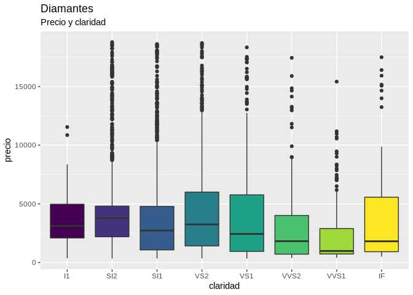

# datos 

[](https://cran.r-project.org/package=datos)
[](https://github.com/cienciadedatos/datos/actions)

Este paquete provee la traducción al español de conjuntos de datos en
inglés originalmente disponibles en otros paquetes de R. Los datos
traducidos son los que se utilizan en los ejemplos del libro [R para
Ciencia de Datos](https://cienciadedatos.github.io/r4ds/), la versión en
español de [R for Data Science](https://r4ds.had.co.nz/) de Hadley
Wickham & Garrett Grolemund. El paquete `datos` puede utilizarse junto
con el libro o de manera independiente como fuente de datos de práctica
en español.

## Instalación

El paquete `datos` puede instalarse directamente desde CRAN:

``` r
install.packages("datos")
```

La versión en desarrollo está disponible en GitHub y puede instalarse
utilizando `remotes`:

``` r
# install.packages("remotes")
remotes::install_github("cienciadedatos/datos")
```

## Traducciones

Las traducciones disponibles dentro de `datos` son las siguientes:

| Nombre             | Titulo                                                                                                 | Paquete        | Dataset        |
|:-------------------|:-------------------------------------------------------------------------------------------------------|:---------------|:---------------|
| premios_dirigentes | Tabla de premios de los dirigentes                                                                     | Lahman         | AwardsManagers |
| bateadores         | Tabla de estadísticas de bateo                                                                         | Lahman         | Batting        |
| jardineros         | Tabla de estadísticas de jardineros                                                                    | Lahman         | Fielding       |
| dirigentes         | Tabla de dirigentes                                                                                    | Lahman         | Managers       |
| personas           | Tabla de personas                                                                                      | Lahman         | People         |
| lanzadores         | Tabla de estadísticas de lanzadores                                                                    | Lahman         | Pitching       |
| salarios           | Tabla de salarios                                                                                      | Lahman         | Salaries       |
| nombres            | Nombres de bebés                                                                                       | babynames      | babynames      |
| fiel               | Datos del géiser Viejo Fiel (Old Faithful)                                                             | datasets       | faithful       |
| flores             | Datos sobre la flor Iris de Edgar Anderson                                                             | datasets       | iris           |
| mtautos            | Pruebas de ruta de automóviles de Motor Trend                                                          | datasets       | mtcars         |
| encuesta           | Muestra de variables categóricas de una encuesta social                                                | forcats        | gss_cat        |
| comunes            | Modelos comunes de vehículos                                                                           | fueleconomy    | common         |
| vehiculos          | Datos de economía de combustible                                                                       | fueleconomy    | vehicles       |
| paises             | Datos de Gapminder                                                                                     | gapminder      | gapminder      |
| diamantes          | Precio de 50.000 diamantes                                                                             | ggplot2        | diamonds       |
| millas             | Datos de economía de combustible de 1999 y 2008 para 38 modelos populares de automóviles               | ggplot2        | mpg            |
| presidencial       | Periodos de 11 presidentes, desde Eisenhower a Obama                                                   | ggplot2        | presidential   |
| datos_credito      | Datos de crédito                                                                                       | modeldata      | credit_data    |
| atmosfera          | Datos atmosféricos                                                                                     | nasaweather    | atmos          |
| aerolineas         | Nombres de aerolíneas                                                                                  | nycflights13   | airlines       |
| aeropuertos        | Datos de aeropuertos                                                                                   | nycflights13   | airports       |
| vuelos             | Datos de vuelos                                                                                        | nycflights13   | flights        |
| aviones            | Datos de aviones                                                                                       | nycflights13   | planes         |
| clima              | Datos de clima                                                                                         | nycflights13   | weather        |
| pinguinos          | Medidas de tamaño de pingüinos adultos en busca de comida cerca de la estación Palmer en la Antártica. | palmerpenguins | penguins       |
| tabla1             | Registros de tuberculosis de la Organización Mundial de la Salud (1era variante)                       | tidyr          | table1         |
| tabla2             | Registros de tuberculosis de la Organización Mundial de la Salud (2da variante)                        | tidyr          | table2         |
| tabla3             | Registros de tuberculosis de la Organización Mundial de la Salud (3ra variante)                        | tidyr          | table3         |
| tabla4a            | Registros de tuberculosis de la Organización Mundial de la Salud (variante 4a)                         | tidyr          | table4a        |
| tabla4b            | Registros de tuberculosis de la Organización Mundial de la Salud (variante 4b)                         | tidyr          | table4b        |
| tabla5             | Registros de tuberculosis de la Organización Mundial de la Salud (5ta variante)                        | tidyr          | table5         |
| oms                | Datos de tuberculosis de la Organización Mundial de la Salud                                           | tidyr          | who            |

Los datos para practicar la manipulación de cadenas (*strings*) son
`oraciones`, `palabras` y `frutas`.

## Uso

El paquete `datos` se carga igual que todos los paquetes de R:

``` r
library(datos)
library(ggplot2)
library(dplyr)
```

Las variables que contienen los datos van a estar disponibles
inmediatamente para su uso, pero los datos no se traducirán hasta que la
variable sea “llamada” explícitamente en el código que se escriba. En
este ejemplo, el *dataset* `diamantes`, que proviene de
`ggplot2::diamonds`, se carga en la memoria de R en el momento en que lo
llamamos por primera vez en español:

``` r
glimpse(diamantes)
```

    ## Rows: 53,940
    ## Columns: 10
    ## $ precio      <int> 326, 326, 327, 334, 335, 336, 336, 337, 337, 338, 339, 340…
    ## $ quilate     <dbl> 0.23, 0.21, 0.23, 0.29, 0.31, 0.24, 0.24, 0.26, 0.22, 0.23…
    ## $ corte       <ord> Ideal, Premium, Bueno, Premium, Bueno, Muy bueno, Muy buen…
    ## $ color       <ord> E, E, E, I, J, J, I, H, E, H, J, J, F, J, E, E, I, J, J, J…
    ## $ claridad    <ord> SI2, SI1, VS1, VS2, SI2, VVS2, VVS1, SI1, VS2, VS1, SI1, V…
    ## $ profundidad <dbl> 61.5, 59.8, 56.9, 62.4, 63.3, 62.8, 62.3, 61.9, 65.1, 59.4…
    ## $ tabla       <dbl> 55, 61, 65, 58, 58, 57, 57, 55, 61, 61, 55, 56, 61, 54, 62…
    ## $ x           <dbl> 3.95, 3.89, 4.05, 4.20, 4.34, 3.94, 3.95, 4.07, 3.87, 4.00…
    ## $ y           <dbl> 3.98, 3.84, 4.07, 4.23, 4.35, 3.96, 3.98, 4.11, 3.78, 4.05…
    ## $ z           <dbl> 2.43, 2.31, 2.31, 2.63, 2.75, 2.48, 2.47, 2.53, 2.49, 2.39…

Los datos traducidos quedarán cargados durante toda la sesión de R:

``` r
diamantes %>%
  filter(corte == "Bueno") %>%
  ggplot() +
  geom_boxplot(aes(claridad, precio, fill = claridad)) +
  theme(legend.position = "none") +
  labs(title = "Diamantes", subtitle = "Precio y claridad")
```


